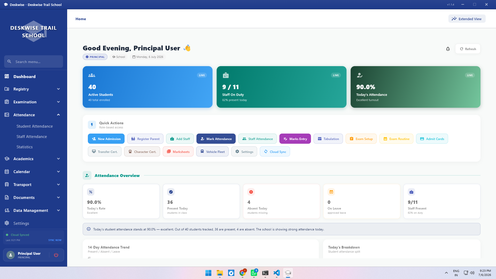
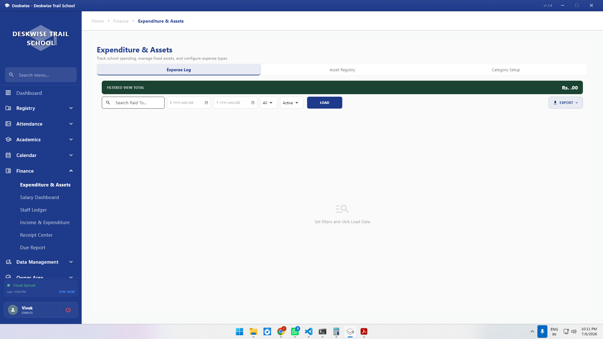
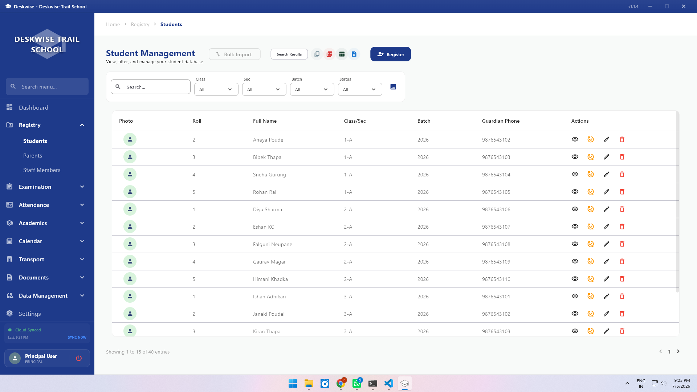
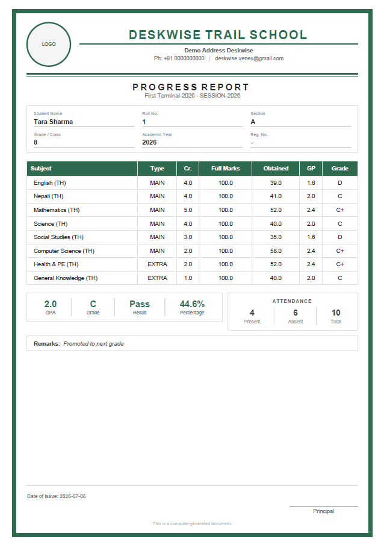
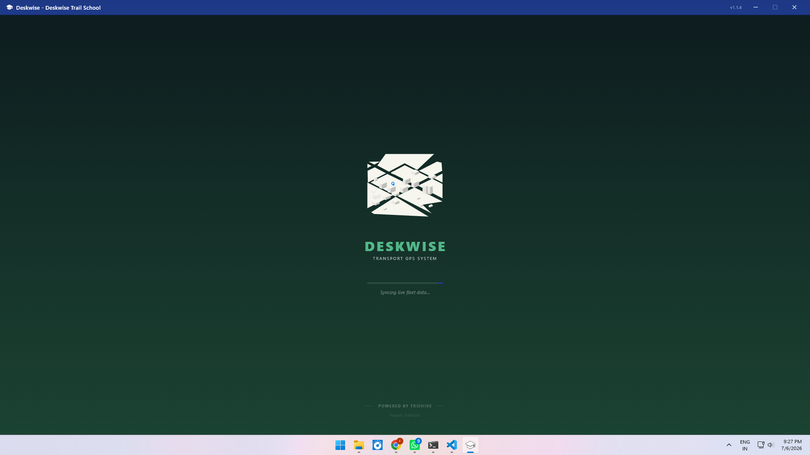
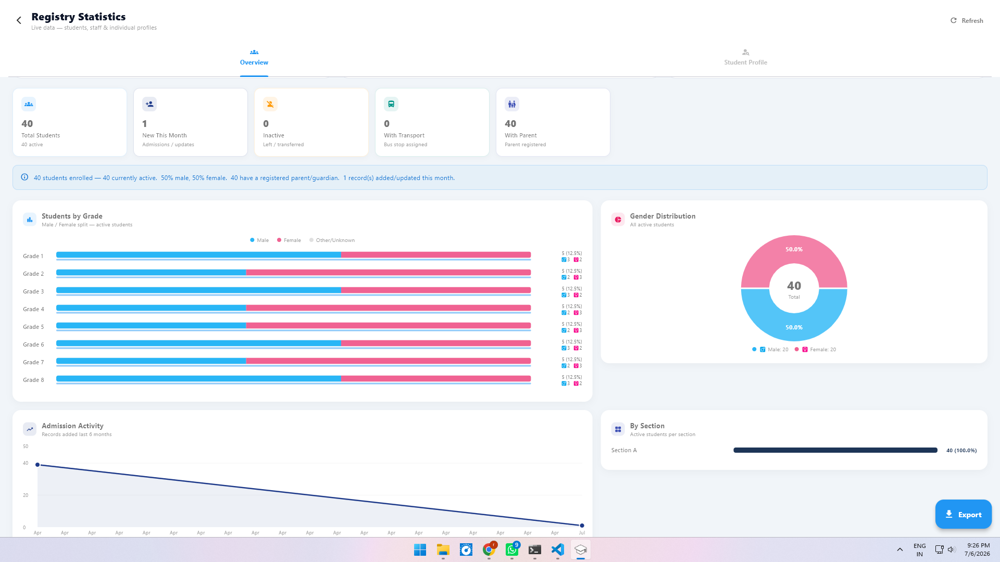
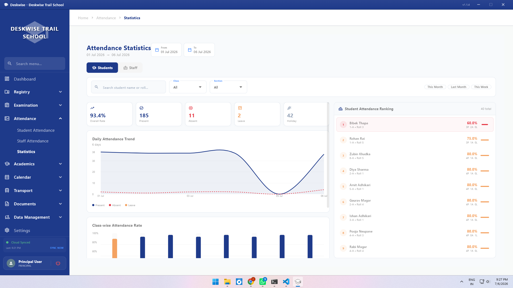
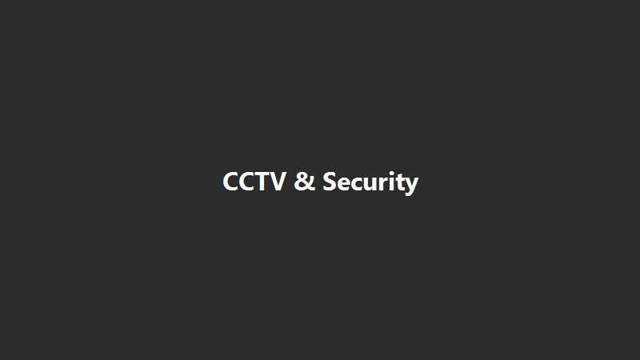
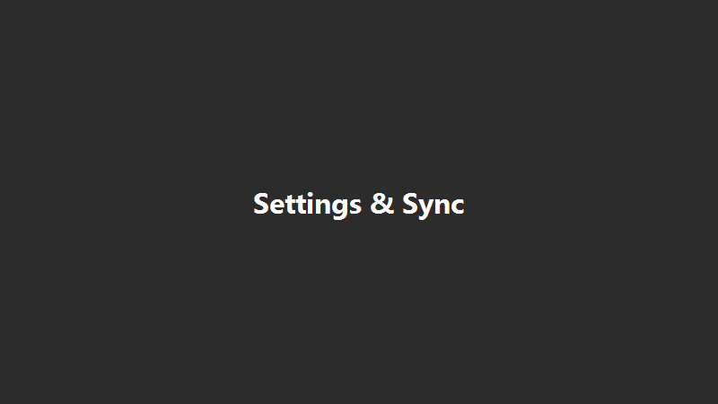

<div align="center">


[](https://github.com/xenexstudio/Deskwise-updates/releases/latest)
[](https://github.com/xenexstudio/Deskwise-updates/releases/latest)
[](./LICENSE)

### One system for your whole school — from admission to graduation.


Deskwise brings attendance, fees, report cards, transport and staff records into a single, simple system. It works on your school's own computer, online or offline.

[**Book a free demo**](mailto:deskwise.xenex@gmail.com) · [What it does](./docs/FEATURES.md) · [Getting set up](./docs/INSTALL.md) · [Plans](./docs/PRICING.md)

</div>

---

> [!IMPORTANT]
> **Deskwise is licensed per school.** Email [deskwise.xenex@gmail.com](mailto:deskwise.xenex@gmail.com) and we'll set you up — no technical background needed.

---

## What is Deskwise?

Most schools end up running on five different systems — a paper register for attendance, a ledger for fees, a spreadsheet for marks, and a WhatsApp group for everything else. Deskwise replaces all of it with **one system** that your office staff, teachers, and parents can all use.

It's built for schools that can't always count on the internet — everything keeps working through a power cut or a network outage, and quietly catches up once you're back online.

## What it does for your school

**📚 Academics** — Enter marks once; Deskwise works out grades and GPA automatically, and prints report cards, transfer certificates and character certificates in your choice of design.

**💰 Fees & finance** — Set your fee structure once. Invoices, receipts, scholarships, and reminders for overdue payments are handled for you, with a live view of collections and expenses.

**📋 Attendance** — Mark students and staff present in seconds, from the school computer or the web. Monthly summaries and trends are ready whenever you need them.

**🚌 Transport** — Map your bus routes, assign students to stops, and see the whole fleet moving on a live map — even offline.

**👥 Students & staff** — Every record, from admission to exit, with photos, documents, and history all in one searchable place.

**✅ Approvals** — Sensitive changes — a fee waiver, a staff exit, a salary change — go through an approval chain you define, with a clear record of who approved what.

**🌐 Web portal** — A companion website so teachers can mark attendance and enter marks from any device, and parents can check fees, attendance, and progress without installing anything.

**🔒 Security** — Every record is encrypted, backups happen automatically, and every change is logged with who made it and when. [Read more →](./SECURITY.md)

**📷 CCTV** — View your school's existing security cameras right inside Deskwise.

---

## 📸 A look inside

*Six real screens below; three are still placeholders — see the note underneath.*

| Dashboard | Finance | Registry |
|:---:|:---:|:---:|
|  |  |  |

| Academics | Transport | Reports |
|:---:|:---:|:---:|
|  |  |  |

| Attendance | CCTV | Settings |
|:---:|:---:|:---:|
|  |  |  |

> **Note:** Attendance, CCTV and Settings are placeholders. See [`screenshots-guide.txt`](./screenshots-guide.txt) for exactly what to capture and where to drop the files in.

---

## Who uses Deskwise

| | |
|---|---|
| 🏫 **Principals** | See the whole school at a glance — enrolment, attendance, finances, and staff, in one dashboard. |
| 🧑‍💼 **Office & admin staff** | Handle admissions, fees, and records without juggling spreadsheets. |
| 👩‍🏫 **Teachers** | Mark attendance and enter marks from the web, from anywhere. |
| 👪 **Parents** | Check fees, attendance and progress online — no app install needed. |

---

## Why schools choose Deskwise

| | Deskwise | Typical alternatives |
| :--- | :---: | :---: |
| Works without internet | ✅ Full offline | ❌ Cloud-only |
| Data encryption | ✅ Always on | ❌ Often unencrypted |
| Bus tracking | ✅ Included | ⚠️ Paid add-on |
| Report card & certificate designs | ✅ 9 to choose from | ⚠️ 1–2 basic |
| Payroll matches attendance | ✅ Automatic | ❌ Manual |
| Software updates | ✅ Silent, automatic | ❌ Manual reinstall |

<div align="center">


</div>

## Getting started

1. **Tell us about your school** — student count, staff size, what matters most to you.
2. **We set it up** — installed, configured, and loaded with your school's details.
3. **Your staff get trained** — a guided walkthrough so everyone's comfortable from day one.
4. **You go live** — with support on call whenever you need it.

Already have a license and just need the setup steps? See the [full installation guide](./docs/INSTALL.md).

---

## Plans

Every plan includes every module — there are no per-module charges.

| | Foundation | Advantage | Premier | Enterprise |
|---|:---:|:---:|:---:|:---:|
| School size | 200–399 students | 400–599 students | 600–799 students | 800+ students |
| Installations | 3 | 5 | 7 | Custom |
| Annual price | **₹20,000** | **₹32,000** | **₹48,000** | ₹65,000+ |
| Monthly price | ₹2,000 | ₹3,200 | ₹4,800 | Custom |
| Certificate designs included | 1 + 1 + 1 | 2 + 2 + 2 | 2 + 2 + 2 | Custom |
| Mobile & web apps | ✅ | ✅ | ✅ | ✅ |
| Priority support | | | | ✅ |

See the [full pricing page](./docs/PRICING.md) for monthly vs. annual options, extra installations, add-ons, and our Founding Schools offer.

---

## 📚 Documentation

| Doc | What's in it |
| :--- | :--- |
| [What it does](./docs/FEATURES.md) | Every module, explained in plain language |
| [Getting set up](./docs/INSTALL.md) | Installation, updates, backups |
| [Plans](./docs/PRICING.md) | Foundation through Enterprise |
| [Security](./SECURITY.md) | How data is protected, and how to report a vulnerability |

---

## 📞 Contact

📧 [deskwise.xenex@gmail.com](mailto:deskwise.xenex@gmail.com)

---

<details>
<summary><strong>Technical details</strong> (for your IT team or system integrator)</summary>

<br>

**Current release** — `v2.0.6+25` · Stable · Windows 10/11 (64-bit) · Released May 2026
[Full release notes →](https://github.com/xenexstudio/Deskwise-updates/releases/latest)

**What's new in v2.0.6:**
- Security hardening — stronger license verification and fail-closed guards
- Fixed crashes during PDF exports of due reports, plus added diagnostics
- UI polish to the Fee Billing sidebar and print workflows
- General stability improvements

**Tech stack**

| Layer | Technology |
|-------|-----------|
| Desktop | Flutter (Dart), desktop-first |
| Web | Next.js (React) |
| Local database | SQLite via `sqflite_common_ffi`, encrypted with SQLCipher (AES-256) |
| Cloud backend | Supabase (PostgreSQL + Auth + Storage + RPC) |
| Auth (web) | Supabase Auth (staff/principal) + custom RPC (parent) |
| PDF generation | `pdf` + `printing` packages |
| Charts | `fl_chart` (desktop), Recharts (web) |
| Secure storage | `flutter_secure_storage` |
| Encryption | `dbcrypt` (bcrypt), `encrypt` (AES-256), `crypto` (HMAC/SHA-256) |
| Maps | `flutter_map` + OpenStreetMap |
| Notifications | Firebase Cloud Messaging |
| Audit | `audit_logs` table (Supabase) + Firebase Firestore for admin activity |

**Security & licensing**
- AES-256 encrypted local database (SQLCipher), hardware-bound key
- bcrypt password hashing for local authentication
- HMAC-signed, device-locked license keys, with clock-tamper detection
- Remote device deactivation from the cloud
- Encrypted backups (AES-256, random IV)
- 90-day audit trail on every data change (`audit_logs`)
- 50+ granular, JSON-driven permission keys per role

**Role hierarchy:** `owner` > `developer` > `principal` > `admin` > `vice_principal` > `accountant` > `coordinator` > `staff` — `admin`, `vice_principal`, `accountant` and `coordinator` are unique per school; `owner` and `developer` bypass permission checks entirely.

**Sync** — Bidirectional push/pull against Supabase, 60-second connectivity detection, per-row `is_synced` tracking, timestamp-based conflict resolution, and a pre-sync encrypted backup before every cycle.

**Database** — 42 tables across 16 schema files, covering everything from admissions to alumni, fully encrypted at rest with SQLCipher AES-256.

**Architecture**

```
┌──────────────────────────────────────────────────────────────┐
│                    Deskwise Desktop App                        │
├──────────────────────────────────────────────────────────────┤
│                        Flutter / Dart                          │
├──────────────┬───────────────────────────┬────────────────────┤
│  Local Mode  │    Sync Engine            │  Online Mode       │
│  (Offline)   │  (Bidirectional Push/Pull)│  (Connected)       │
├──────────────┴───────────────────────────┴────────────────────┤
│              SQLCipher Encrypted SQLite                        │
│              (AES-256 at rest)                                 │
├──────────────────────────────────────────────────────────────┤
│                    Windows 10 / 11 (64-bit)                    │
└─────────────────────────┬────────────────────────────────────┘
                          │ Sync (Supabase REST)
                          ▼
┌──────────────────────────────────────────────────────────────┐
│                       Supabase Cloud                          │
├──────────────────────────────────────────────────────────────┤
│  PostgreSQL DB  │  Auth  │  Storage  │  RPC / Edge Functions │
└─────────────────────────┬────────────────────────────────────┘
                          │ PostgreSQL (same schema)
                          ▼
┌──────────────────────────────────────────────────────────────┐
│                 Deskwise Web Portal (Next.js)                  │
├──────────────────────────────────────────────────────────────┤
│                   React / Next.js 14 (App Router)              │
├──────────────┬───────────────────┬───────────┬───────────────┤
│  /principal  │    /staff         │  /parent  │               │
│  (Principal) │  (Staff Portal)   │(Parent)   │ (Super Admin) │
└──────────────┴───────────────────┴───────────┴───────────────┘
```

**Web portal routes** — `/staff/*`, `/principal/*`, `/parent/*`, `/admin/*`. Full page-by-page permission maps live in [`docs/FEATURES.md`](./docs/FEATURES.md).

</details>

<div align="center">


*© 2024–2026 Xenex · Built for Indian schools, for Indian education*

</div>