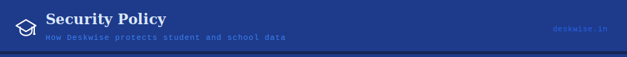

[← Back to README](./README.md)

---

## Supported Versions

| Version | Support status |
|---------|---------------|
| `v2.0.x` | ✅ Active — all patches |
| `v1.2.x` | ⚠️ Critical fixes only |
| `< v1.2` | ❌ End of life — upgrade required |

---

## Security Architecture

Deskwise handles some of the most sensitive personal data in any community — children's identities, family contacts, financial records. Every layer of the system is designed with that responsibility in mind.

| Layer | Protection |
|-------|-----------|
| **SQLCipher** | AES-256 encrypted local database. Encryption key is hardware-bound — data on one device is cryptographically inaccessible from another. |
| **Hardware lock** | Each license is bound to a specific machine UUID. Prevents unauthorized installation, copying, or data exfiltration. |
| **Role-based access** | Principal, Admin, and Staff roles carry granular permission layers. Sensitive records are visible only to authorized roles. |
| **90-day audit trail** | Every action logged with timestamp and user identity. Full accountability built into the architecture. |
| **Supabase RLS** | Row-level security policies at the cloud layer — each school's data is completely isolated. No cross-school data access is possible. |
| **Encrypted sync** | All synchronization traffic is encrypted end-to-end. |

---

## Reporting a Vulnerability

Deskwise handles sensitive student and institutional data. **Please do not open public GitHub issues for security vulnerabilities.**

**Report privately:**

- 📧 **Email:** [studioxenex@gmail.com](mailto:studioxenex@gmail.com)
- 📝 **Subject line:** `[SECURITY] Brief description of the issue`

**Response commitments:**
- Acknowledgement within **48 hours**
- Fix or mitigation within **14 days** (depending on severity)

---

## Scope

Reports are welcomed for:

- Authentication or license validation bypass
- Unauthorized access to student, staff, or financial data
- Database encryption weaknesses
- Cloud sync or Supabase data exposure vulnerabilities
- Hardware license check bypasses

---

[← Back to README](./README.md)

*© 2024–2026 Xenex*

