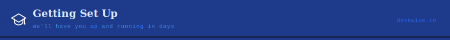

<div align="center">



[← Back to README](../README.md) · [What it does](./FEATURES.md) · [Plans](./PRICING.md)

</div>

---

## Most schools don't need this page

When you sign up, we install Deskwise on your school's computer ourselves, load in your school's details, and walk your staff through it. This page is here for reference — for your IT person, or if you'd simply like to know what happens behind the scenes.

---

## What your computer needs

| | Minimum | Recommended |
|-------------|---------|-------------|
| Operating system | Windows 10 (64-bit) | Windows 11 |
| Memory | 4 GB | 8 GB |
| Free storage | 10 GB | 20 GB |
| Screen | 1280 × 720 | 1920 × 1080 |
| Internet | Not required for daily use | 10 Mbps+, for cloud sync |

## Setting up

1. **Get your license key.** Email [deskwise.xenex@gmail.com](mailto:deskwise.xenex@gmail.com) — every school needs one key to activate Deskwise.
2. **Install Deskwise.** We'll either install it for you remotely, or send you a simple installer to run.
3. **Activate.** Enter your license key when prompted. Deskwise links itself to that computer automatically.
4. **Create your admin account**, and enter your school's name, registration code, and academic year.
5. **Set up the basics** — grades and sections, fee structure, staff records, and your student list (we can help import this from an existing spreadsheet).
6. *(Optional)* **Turn on cloud sync** under Settings, if you'd like your data backed up online and available across devices.

## Staying up to date

Deskwise checks for updates on its own and lets you know when one's ready. Click **Update Now** and it downloads and applies the update in the background — nothing else to do. Your data updates automatically the next time you open the app.

## Backing up your data

Go to **Settings → Backup → Create Backup** any time you'd like a copy. Deskwise also does this for you automatically — every day the app is open and connected, and before every update. Backup files are encrypted, and the last three are always kept.

To bring a backup back, go to **Settings → Backup → Restore**, choose the file, and confirm.

> [!WARNING]
> Keep a copy of your backup files somewhere outside the school computer — a USB drive, an external hard disk, or cloud sync. Xenex can't recover files lost to a formatted or damaged device.

## If something goes wrong

| What you see | What it means |
|-------|-----------|
| "License Not Found" | Double check the key. Contact us if you've lost it. |
| "Device Not Registered" | Contact us with the machine ID shown on screen. |
| "Database Corrupted" | Restore your most recent backup. No backup? Contact us — we may still be able to help. |
| "Sync Failed" | Check the internet connection, or try a manual sync again later from Settings. |
| "Clock Tamper Detected" | The system clock was moved backward — this is a security check. Contact us. |

## Uninstalling

1. Take a backup first: **Settings → Backup → Create Backup**.
2. Delete the Deskwise folder.
3. Remove any desktop shortcuts.

## Support

📧 [deskwise.xenex@gmail.com](mailto:deskwise.xenex@gmail.com)

---

<details>
<summary><strong>Technical details</strong> (for IT teams and system integrators)</summary>

<br>

**Manual download & install**

- GitHub: https://github.com/xenexstudio/Deskwise-updates/releases/latest
- Website: https://deskwise.in/downloads

Download `deskwise_vX.X.X.zip`, extract it to `C:\Program Files\Deskwise`, and run `deskwise.exe`. No installer is required — the app runs directly from the extracted folder.

**Manual update**

1. Download the latest `deskwise_vX.X.X.zip` from Releases.
2. Back up first: `Settings → Backup → Create Backup`.
3. Close Deskwise completely.
4. Extract the new files over the existing folder.
5. Launch `deskwise.exe` — database migrations run automatically.

**Command line options**

```batch
:: Use a custom data directory
deskwise.exe --data-path="D:\SchoolData"

:: Enable debug logging
deskwise.exe --debug
```

**Full uninstall** — after removing the application folder, optionally delete `%APPDATA%\Deskwise` to remove all local app data.

</details>

---

<div align="center">

[← Back to README](../README.md) · [What it does](./FEATURES.md) · [Plans →](./PRICING.md)

*© 2024–2026 Xenex*

</div>
