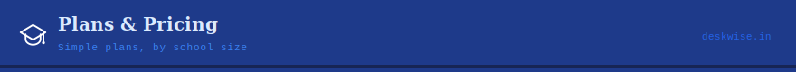

[← Back to README](../README.md) · [Features](./FEATURES.md) · [Installation](./INSTALL.md)

---

## Plans

All tiers include every module — finance, registry, academics, payroll, transport, CCTV, cloud sync, and security. No per-module charges. No surprises.

| Tier | School Size | Devices | Included Certificates | Mobile Apps |
|------|-------------|---------|----------------------|-------------|
| **Foundation** | 200 – 399 students | 3 | 1 report + 1 TC + 1 CC | ✅ |
| **Advantage** | 400 – 599 students | 5 | 2 reports + 2 TC + 2 CC | ✅ |
| **Premier** | 600 – 799 students | 7 | 2 reports + 2 TC + 2 CC | ✅ |
| **Enterprise** | 800+ students | Custom | Custom | ✅ |

> *Pricing not yet finalised — contact [deskwise.xenex@gmail.com](mailto:deskwise.xenex@gmail.com) for details.*

---

## What's Included in Every Plan

- ✅ All modules — no per-module charges
- ✅ Offline-first architecture — works without internet
- ✅ AES-256 SQLCipher encryption
- ✅ Cloud sync via Supabase
- ✅ Silent over-the-air auto-updates
- ✅ Encrypted backup system
- ✅ Mobile apps (Android & iOS)
- ✅ Email support

---

## Add-Ons

Need more than what your plan includes? All extras available à la carte:

| Add-On | Description |
|--------|-------------|
| Extra device license | Add another installation beyond plan limit |
| Additional certificate | Extra report card, TC, or CC template per slab |
| Staff web access | Web portal access for staff members |
| Dedicated onboarding | Full guided setup and training |
| Custom branding | School logo and theme inside the app |

---

## Enterprise

For schools with 800+ students or special requirements:

- **Dedicated onboarding** — full guided setup
- **Custom branding** — your school logo inside the app
- **Multi-school dashboard** — centralized management across campuses
- **Priority feature access** — early access to new modules
- **SLA guarantee** — committed response and resolution times
- **Custom integrations** — on request

Contact [deskwise.xenex@gmail.com](mailto:deskwise.xenex@gmail.com) for a custom quote.

---

## How to Purchase

1. **Enquire** — email Xenex to get started
2. **Demo** — request a free guided walkthrough of the platform
3. **Select plan** — choose the tier that matches your enrollment
4. **Payment** — bank transfer or UPI
5. **Activate** — receive your license key by email and go live

---

## Renewals & Upgrades

- Licenses renew **annually**
- Renewal reminder sent **30 days before expiry**
- **Upgrades** take effect immediately from the next billing cycle
- **Downgrades** are processed at the end of the current period
- **Cancellation** — access continues to end of paid period

---

## Contact

| Channel | Details |
|---------|---------|
| Email | [deskwise.xenex@gmail.com](mailto:deskwise.xenex@gmail.com) |

---

[← Back to README](../README.md) · [Features →](./FEATURES.md)

*© 2024–2026 Xenex*

